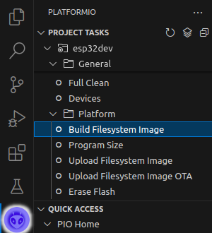
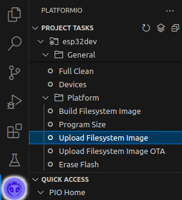
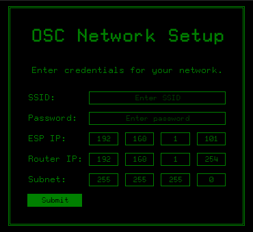
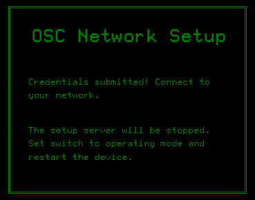
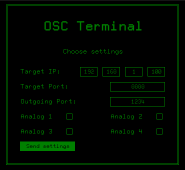
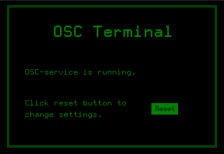

# OSC32 – Wireless interaction processing

## Introduction
The OSC32-Project aims to serve an easy to use device for wireless interaction processing. Whether you use it for live visuals or interactive installations, the setup is supposed to be dead simple.

OSC32 – in its current version – makes use of the [OpenSoundControl-protocol](https://opensoundcontrol.stanford.edu/) to transmit values of analogue inputs (e.g. a potentiometer, a button, a temperature sensor, etc.) from the point they are obtained to a host. 

Typically the host is a computer on which the values are used to trigger a variety of events. A popular use case is the combination with mapping software like [MadMapper](https://madmapper.com/).

The project is maintained by [IotSteve](https://github.com/IoTSteve/) and [ElTrasho3000](https://github.com/ElTrasho3000/).

## Usage
### Prerequisities
- [Visual Studio Code](https://code.visualstudio.com/) with [PlatformIO-Extension](https://platformio.org/)
- ESP32-Dev Kit C V2
- Breadboard and peripherals
### Installation
- Either download or clone this repository
- Open the PlatformIO-Project inside the repository in VSCode
- Navigate to PlatformIO in primary side bar
- Connect your ESP32 Dev Board\
(Currently only tested on Dev Kit C V2 with EPS32-WROOM-32)
- Under "Project Tasks" go to "Platform -> Build Filesystem Image"\

- When it's done, go to "Upload Filesystem Image"\

- Then Build(Ctrl+Alt+U) and Upload(Ctrl+Alt+U)
- Once the upload is succesfully finished, the device is ready to use
### Setup
#### Hardware
- We will offer a breakout board in the future
- We recommend using a breadboard to make wiring easier
- To enable setup-mode connect GPIO-27 to 3v3 and re-/start device\
(The pin is set to INPUT_PULLDOWN, using a switch to\
connect to 3v3 is recommended for long-term usage)
- Analog input 1 is GPIO-34
- Analog input 2 is GPIO-35
- Analog input 3 is GPIO-32
- Analog input 4 is GPIO-33

#### Software
In setup mode:
- Connect to the WiFi Access Point named "OSC-Setup-Terminal-[device ID]"
- Open a browser and go to "192.168.4.1"(The default ESP32-IP)
- You will reach the Network Setup page\

- Enter your desired configuration and press "Submit".
- You should be redirected to success page

- Restart the device.

In operation mode:
- Connect to the WiFi you will be working in.
- Open a browser and got to the IP you declared in the setup as "ESP IP"
- You will reach the OSC-Terminal\

- Enter your desired configuration and press "Send settings"
- You should be redirected to success page\

- If you want to change settings, press "Reset"